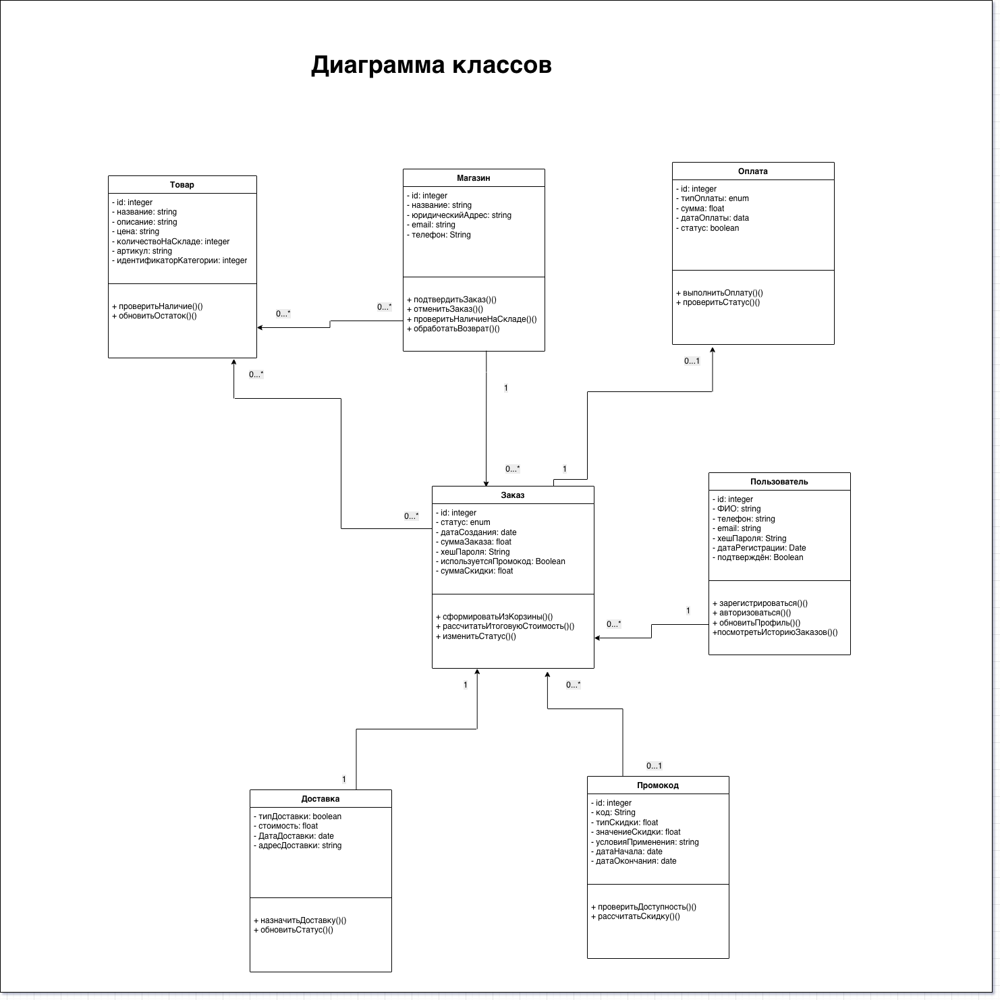
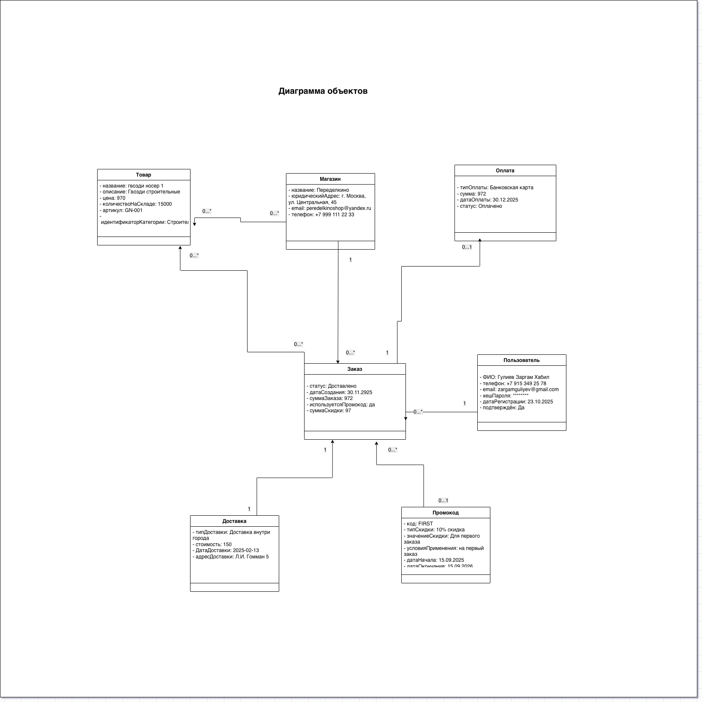

# Оптимизация оформления заказа в e-commerce

## Обзор проекта

Данный проект посвящён анализу и улучшению процесса оформления заказа на платформе электронной коммерции.

Цель проекта — выявить узкие места в процессе оформления заказа и спроектировать более эффективный пользовательский путь, который снизит количество брошенных корзин и улучшит общий опыт совершения покупки.

Проект включает анализ текущего процесса оформления заказа, выявление ключевых проблем удобства использования и проектирование оптимизированного процесса.

---

# Бизнес-проблема

Анализ текущего процесса оформления заказа выявил ряд проблем, негативно влияющих на конверсию.

Ключевые проблемы:

- длинный и сложный процесс оформления заказа
- избыточные поля в формах
- дублирование вводимых данных
- непонятные сообщения о валидации и ошибках

Эти проблемы приводят к:

- высокому проценту брошенных корзин
- увеличению времени оформления заказа
- неудовлетворительному пользовательскому опыту при покупке

---

# Решение

Предлагаемое решение предусматривает оптимизированный процесс оформления заказа, ориентированный на упрощение пути покупки.

Ключевые элементы решения:

- сокращение количества шагов оформления заказа  
- группировка связанных полей ввода  
- внедрение автозаполнения данных покупателя  
- улучшенная валидация и информативные сообщения об ошибках  

Эти улучшения направлены на то, чтобы сделать процесс оформления заказа быстрее и удобнее для пользователя.

---

# Моя роль как бизнес-аналитика

В рамках проекта я выполнил следующие задачи:

- анализ текущего процесса оформления заказа
- выявление проблем удобства использования в процессе покупки
- моделирование **бизнес-процесса AS-IS**
- проектирование **оптимизированного процесса TO-BE**
- создание **Customer Journey Map**
- разработка **Lo-Fi прототипов интерфейса**

---

# Моделирование бизнес-процессов

## Процесс AS-IS

BPMN-модель AS-IS отражает текущий процесс оформления заказа.

Текущий процесс оформления заказа:

1. Пользователь добавляет товары в корзину
2. Открывает страницу оформления заказа
3. Заполняет личные данные
4. Выбирает способ доставки
5. Выбирает способ оплаты
6. Подтверждает заказ

Анализ выявил ряд неэффективностей в данном процессе.

---

## Процесс TO-BE

Модель TO-BE предусматривает упрощённый процесс оформления заказа с меньшим количеством шагов и улучшенным взаимодействием с пользователем.

Основные улучшения:

- упрощённый ввод данных
- сокращение шагов оформления заказа
- улучшенная логика валидации
- оптимизированный процесс подтверждения заказа

---

# Анализ пользовательского опыта

Customer Journey Mapping применялся для анализа опыта клиента в процессе оформления заказа.

Это позволило выявить болевые точки в пути пользователя и определить возможности для улучшения процесса покупки.

---

# Lo-Fi прототип

Прототип низкой точности разработан для демонстрации улучшенного интерфейса оформления заказа.

Прототип включает переработанные экраны с упрощёнными формами ввода и более понятным взаимодействием с пользователем.

---

# Артефакты проекта

В репозитории представлены следующие артефакты:

- BPMN-модель процесса AS-IS
- BPMN-модель процесса TO-BE
- Customer Journey Map
- Диаграмма классов UML
- Диаграмма объектов UML
- Lo-Fi прототип интерфейса
- Презентация проекта

---

# Использованные инструменты

- BPMN
- Miro
- Draw.io
- Figma
- Customer Journey Mapping

---

# Ожидаемый бизнес-эффект

Предлагаемое решение позволит компании:

- снизить процент брошенных корзин
- упростить процесс оформления заказа
- улучшить пользовательский опыт при покупке
- повысить конверсию на этапе оформления заказа

---

## Процесс AS-IS (BPMN)

---

## Процесс TO-BE (BPMN)

---

## Диаграмма классов

---

## Диаграмма объектов

---

## Прототип

Прототип в Figma:  
https://www.figma.com/design/mEttQqVuK5qSnQFZGPJRV9/Ruslan-Kuliyevvv-s-team-library?node-id=0-1&t=lWTXDN3gUAVZVGN3-1

---

## Customer Journey Map

https://miro.com/app/board/uXjVJnl-Cqg=/?share_link_id=765060641053

---

## Презентация

https://docs.google.com/presentation/d/1z3UC3SuHwoZCUNpuFSfzhAa9LFClFuGbdtxGCF0tgDo/edit?usp=sharing

---

# Автор

Проект портфолио бизнес-аналитика  
Автор: Заргам Гулиев
